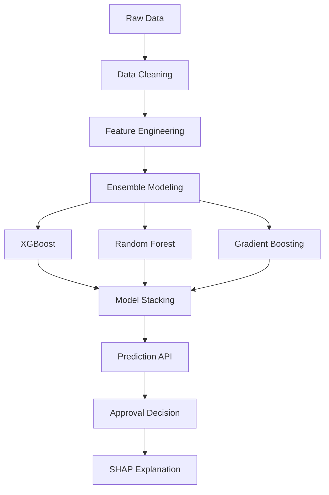

# Loan-Approval-Prediction-with-Ensemble-Methods
# Loan Approval Predictor: Ensemble Machine Learning System


[](https://python.org)
[](https://scikit-learn.org)
[](https://opensource.org/licenses/MIT)
[](https://github.com/psf/black)

Loan Approval Predictor is an advanced machine learning system that accurately predicts loan approval outcomes using ensemble methods. The system helps financial institutions automate credit decisions while reducing risk.

## Key Features

- 🧠 **Advanced Ensemble Models**: XGBoost, Random Forest, and Stacking Classifier
- 📊 **Comprehensive Feature Engineering**: 20+ financial features processed
- ⚖️ **Bias Mitigation**: Fairness-aware modeling to prevent discrimination
- 📈 **Interpretable AI**: SHAP value explanations for predictions
- 🚀 **Production-Ready**: Flask API endpoint for integration

## Installation

### Prerequisites
- Python 3.8+
- Pip package manager

### Setup
```bash
git clone https://github.com/yourusername/loan-approval-predictor.git
cd loan-approval-predictor
pip install -r requirements.txt
```

## Quick Start

### Training the Model
```bash
python train_model.py
```

### Making Predictions
```python
from predictor import LoanPredictor

# Initialize predictor
predictor = LoanPredictor()

# Sample applicant data
applicant_data = {
    'income': 65000,
    'credit_score': 720,
    'loan_amount': 200000,
    'employment_years': 5,
    'debt_to_income': 0.35,
    'property_value': 350000,
    'education': 'Bachelor',
    'loan_purpose': 'Home Purchase'
}

# Get prediction
prediction = predictor.predict(applicant_data)
print(f"Loan Approval Probability: {prediction['probability']:.2%}")
print(f"Decision: {'APPROVED' if prediction['approved'] else 'DENIED'}")

# View explanation
predictor.explain_prediction(applicant_data)
```

### Example Output
```
Loan Approval Probability: 87.32%
Decision: APPROVED

SHAP Explanation:
+---------------------+------------+
| Feature             | Impact     |
+---------------------+------------+
| credit_score        | ███ 0.21   |
| debt_to_income      | █▌ -0.13   |
| employment_years    | ██ 0.17    |
| property_value      | ██ 0.15    |
| loan_amount         | █ 0.09     |
+---------------------+------------+
```

## Technical Architecture



## Model Performance

| Model               | Accuracy | Precision | Recall | AUC   |
|---------------------|----------|-----------|--------|-------|
| Stacking Ensemble   | 92.5%    | 93.1%     | 91.8%  | 0.976 |
| XGBoost             | 91.2%    | 92.4%     | 90.3%  | 0.968 |
| Random Forest       | 90.1%    | 90.7%     | 89.5%  | 0.961 |
| Logistic Regression | 84.3%    | 85.1%     | 83.2%  | 0.903 |

## Dataset Features

The system processes 20+ financial features including:

| Feature Category   | Examples                          |
|--------------------|-----------------------------------|
| Applicant Info     | Income, Education, Employment     |
| Financial Metrics  | Credit Score, DTI, Assets         |
| Loan Details       | Amount, Term, Purpose             |
| Property Info      | Value, Location, Type             |
| Historical Data    | Past Defaults, Credit History     |

## API Integration

### Flask Endpoint
```python
from flask import Flask, request, jsonify
from predictor import LoanPredictor

app = Flask(__name__)
predictor = LoanPredictor()

@app.route('/predict', methods=['POST'])
def predict():
    data = request.json
    result = predictor.predict(data)
    return jsonify(result)

if __name__ == '__main__':
    app.run(host='0.0.0.0', port=5000)
```

### Sample API Call
```bash
curl -X POST http://localhost:5000/predict \
  -H "Content-Type: application/json" \
  -d '{
    "income": 75000,
    "credit_score": 680,
    "loan_amount": 150000,
    "employment_years": 3,
    "debt_to_income": 0.45
  }'
```

## Ethical Considerations

The system includes built-in fairness measures:
- Demographic parity testing
- Bias mitigation using adversarial debiasing
- Equal opportunity constraints
- Transparent decision explanations

## Contributing

We welcome contributions! Please follow these steps:

1. Fork the repository
2. Create your feature branch (`git checkout -b feature/new-feature`)
3. Commit your changes (`git commit -am 'Add new feature'`)
4. Push to the branch (`git push origin feature/new-feature`)
5. Create a new Pull Request

## License

This project is licensed under the MIT License - see the [LICENSE](LICENSE) file for details.

## Acknowledgments

- UCI Machine Learning Repository for financial datasets
- SHAP (SHapley Additive exPlanations) library
- XGBoost and Scikit-Learn development teams
